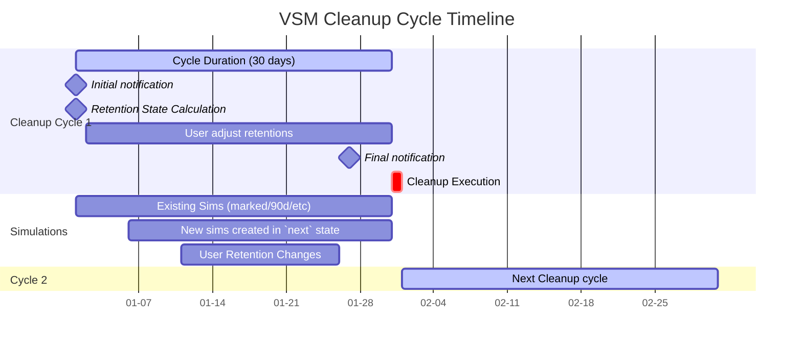

# VSM Cleanup Process Documentation

## Overview

The VSM (Vestas Simulation Management) system implements a comprehensive cleanup process designed to manage simulation data lifecycle efficiently. This document outlines the key concepts, processes, and technical specifications for the cleanup functionality.

## Core Concepts

### Secure Folder

The cleanup is oriented around the concept of a root folder with owners and approvers that represents a team's effort to accomplish a well-defined purpose.

### Cleanup Cycle

The purpose of the cleanup cycle is to ensure that the owner and approvers of the secure folder have time to change the retention of simulations that are marked for cleanup. At the end of the cleanup cycle, the simulations still marked for cleanup will be cleaned.

The cleanup cycle is run on each secure folder by a scheduler according to the secure folder's cleanup frequency.
When the cleanup cycle starts then the cleanup_round_start_date. The owner and approvers are notified when the cleanup cycle starts and 2 workdays before it ends.
two days before the cleanup cycle expired then 

### days_to_analyse: Required period to analyses a simulation
The owner and approvers can define hov many days they need to analyse a simulation since the last modfication of its files.
The longer the period is the more bytes are stored as work in progress. Example in 2023 LaC+Siting+Service did not clean simulations over a 3 months period this resulted in 750 TB of work in process

## Getting Started with Cleanup

### Initial Setup

A secure folder always starts in a state with `cleanup_frequency="inactive"`, meaning that the cleanup process is inactive.

The owner or approvers of the secure folder selects 
- the cleanup frequency that they expect will work for their project: 15 days, 30 days, or 45 days. These choices can be adapted.
- The days the team needs to analyse a simulation from its last modificaiton date til it expires and can be cleaned

### Managing Cleanup Frequency

The cleanup frequency can be changed or paused (`cleanup_frequency="inactive"`):

- **Activating** the cleanup activity will define retention expiration dates as explained below
- **Resuming** will use the previously defined retention expiration dates

The simulation's `retention_expiration_date` is used to calculate the retention states, so the user can change retention of hundreds or thousands of simulations with little effort in the cleanup tool UI.


## Date Management and Calculations

### Key Date Fields

- **`cleanup_round_start_date`**: Marks the day a new cleanup round starts. It will stay the same until a new cleanup round starts. 
Using the `cleanup_round_start_date`, and below paramters we will be able to classify the retention category of old and new simulations.
- **`days_to_analyse`** minmum number of days the simulation must be preserve before cleanup
- **`modified_date`**: The date the simulation was last modified
- **`retention_expiration_date`**: The date when the simulation can be marked for cleanup in a new cleanup round

    
### Available Retention Categories

We operate with the following retention states. All but the non-mandatory states can be changed if needed.

**Retention Catalog** (key=retention_label, value=days_to_cleanup):
- **`marked`** (0 days): Mandatory state. This state is for simulation were the retention expired (`retention_expiration_date <= cleanup_round_start_date`). Changing to this retention sets `retention_expiration_date = cleanup_round_start_date`
- **`next`** (cleanup_frequency days): Mandatory state. 
   - New simulations created in the current cleanup round, that are not path-protected, will have `retention_expiration_date = modified_date` and thus be part of ´Next` 
   - Changing the retention of other simulations to this state sets `retention_expiration_date = cleanup_round_start_date + cleanup_frequency`
- **`90d`** (90 days): Changing to this retention sets `retention_expiration_date = cleanup_round_start_date + 90 days`
- **`180d`** (180 days): Changing to this retention sets `retention_expiration_date = cleanup_round_start_date + 180 days`
- **`365d`** (365 days): Changing to this retention sets `retention_expiration_date = cleanup_round_start_date + 365 days`
- **`730d`** (730 days): Changing to this retention sets `retention_expiration_date = cleanup_round_start_date + 730 days`
- **`1095d`** (1095 days): Changing to this retention sets `retention_expiration_date = cleanup_round_start_date + 1095 days`
- **`path`**: (null) `this state is for path protected simulations` 
- **`clean`**: (null) `this state is for clean simulation so the user can see all simulations` 
- **`issue`**: (null) `this state is for simulation with a cleanup issue so the user can see all simulations`
- **`Missing`**: (null) `this state is for simulation that are no longer found in the root folder for any reason but most likely due to the user renaming or deleting the folder`

Example: when changing the retention of a simulation from `marked` days to `90d` using the UI sets `retention_expiration_date = cleanup_round_start_date + 90 days`


### Retention State Calculation

The retention state can be calculated from the following parameters:

- **`path`**: This is the main retention parameter. ALL simulations under the path must be classified as path protected, even if there is nothing to clean or the simulation has issues such as reproducibility, missing, or multiple ".set" files

- **`clean`**: If the simulation was cleaned by the system or other tools, then set the retention to clean

- **`issue`**: If the simulation cannot be cleaned due to `.set` - file issues or lack of reproducibility (depending on LaC' requirements)

### Calculation Logic

The calculation of the retention for the remaining simulations is based on: 
`days_to_cleanup = retention_expiration_date - cleanup_round_start_date`

**Retention State Ranges:**
- **`marked`**:  `days_to_cleanup ≤ 0`
- **`next`**:    `0 < days_to_cleanup ≤ cleanup_frequency`
- **`90d`**:     `2 × cleanup_frequency < days_to_cleanup ≤ 90 days`
- **`180d`**:    `90 < days_to_cleanup ≤ 180 days`
- **`365d`**:    `180 < days_to_cleanup ≤ 365 days`
- **`730d`**:    `365 < days_to_cleanup ≤ 730 days`
- **`1095d`**:   `730 < days_to_cleanup` 
- **`clean`**:   `this state is for path protected simulations` 
- **`clean`**:   `this state is for clean simulation so the user can see all simulations` 
- **`issue`**:   `this state is for simulation with a cleanup issue so the user can see all simulations`
- **`Missing`**: `this state is for simulation that are no longer found in the root folder for any reason but most likely due to the user renaming or deleting the folder`


## Retention Label Assignment Algorithm

The following pseudocode demonstrates how to determine the appropriate retention label for a simulation based on its calculated days to cleanup:

```pseudocode
// Input: the_simulations_days_to_cleanup (calculated days until cleanup)
// Output: cat_retention_label (assigned retention category)

i = 0
cat = filter(retention_catalog, lambda e: e.value is not null)   // [0, cleanup_frequency, 90, 180, 365, 730, 1095]
cat_days_to_cleanup = cat.values   // [0, cleanup_frequency, 90, 180, 365, 730, 1095]

while (i < len(cat_days_to_cleanup) && cat_days_to_cleanup[i] <= the_simulations_days_to_cleanup) {
    i++
}

cat_retention_label = cat[i].key if i < len(cat_days_to_cleanup) else cat[i-1].key
```

### Algorithm Explanation

This algorithm iterates through the retention catalog values in ascending order to find the first category where the simulation's days to cleanup exceeds the category threshold. The simulation is then assigned to that retention category.

**Example:**
- If a simulation has 80 days to cleanup, it gets assigned the `90d` retention label:
- If a simulation has -1 days to cleanup, it gets assigned to the `marked` retention label
- If a simulation was produced 1 day into the cleanup round then its retention expire in 1 day (`modified_date-cleanup_round_start_date`) and will be assigned to the `next` retention label
- if a simulation' retention is changed to `next` then then its retention expire in `cleanup_frequency` days and will be assigned the `next` retention label

### Timeline for cleanup cycle ###
The following shows:
- An entire cleanup cycle (defines cleanup_round_start_date) and the start of the next cleanup cycle
- Notification of the owner and approvers
- Calculation of retention states
- That the owner and approvers change the retention states during the cycle
- That new simulations might be generated and shown in the UI in the "next" state



### Timeline Explanation

1. **Cycle Start (Day 0)**: 
   - `cleanup_round_start_date` is set
   - Owner and approvers receive notification
   - Retention states are calculated for all simulations

2. **Active Period (Days 1-28)**:
   - Users can review and change retention states.
   - New simulations created during this period get "next" state
 
3. **Final Warning (Day 28)**:
   - 2 workdays before cycle end
   - Final notification to owners/approvers

4. **Cleanup Execution (Day 30)**:
   - Simulations still in "marked" state are cleaned
   - Next cycle begins with new `cleanup_round_start_date`
   - All expired retentions become "marked"   
