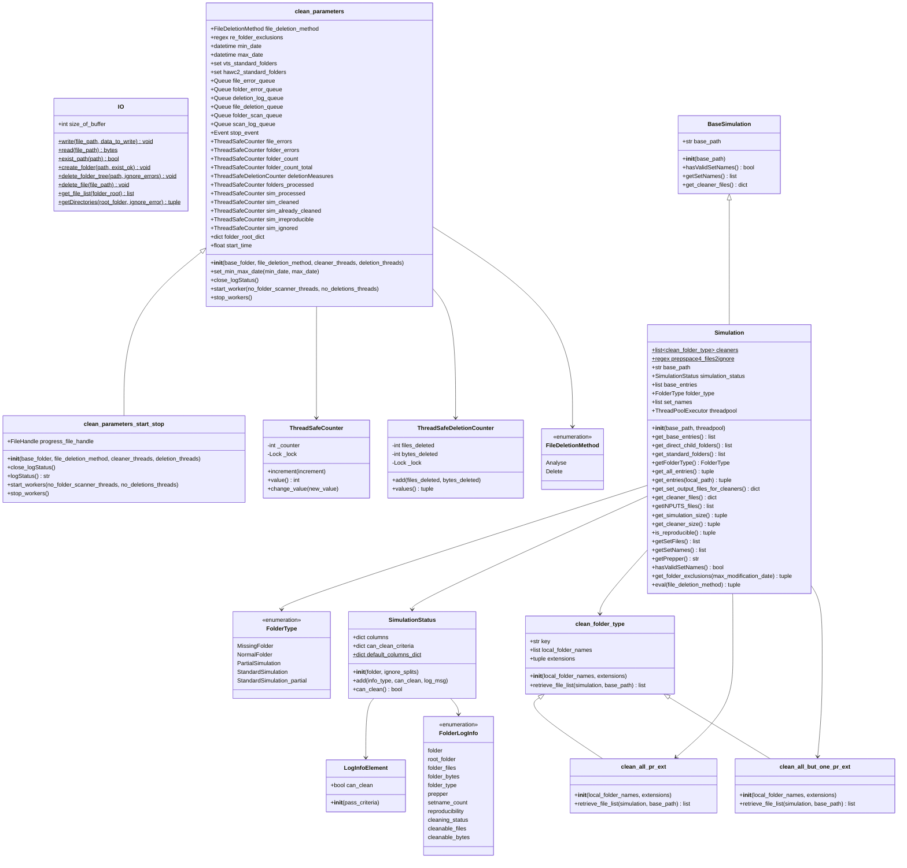

# Mermaid Diagrams for VTS Simulation Cleanup Application

## 1. Class Diagram

## 2. Sequence Diagram - Main Cleanup Flow

## 3. Flow Diagram - Simulation Evaluation Process

## 4. State Diagram - Simulation Processing States

## 5. Entity Relationship Diagram - Data Model

## 6. Component/Architecture Diagram

## 7. Activity Diagram - Worker Thread Coordination

## Summary

These diagrams provide comprehensive views of the VTS simulation cleanup application:

1. **Class Diagram**: Shows all classes, their attributes, methods, and relationships
2. **Sequence Diagram**: Illustrates the main cleanup flow from start to finish
3. **Flow Diagram**: Details the simulation evaluation decision process
4. **State Diagram**: Shows state transitions during simulation processing
5. **Entity Relationship Diagram**: Models the data structures and their relationships
6. **Component/Architecture Diagram**: Shows high-level module organization
7. **Activity Diagram**: Details worker thread coordination and parallel processing

The application is a multi-threaded system that:
- Scans simulation folders recursively
- Evaluates reproducibility based on file timestamps
- Identifies cleanable files using configurable cleaner strategies
- Can either analyze (count) or delete files
- Tracks progress with thread-safe counters
- Logs all operations to CSV files
