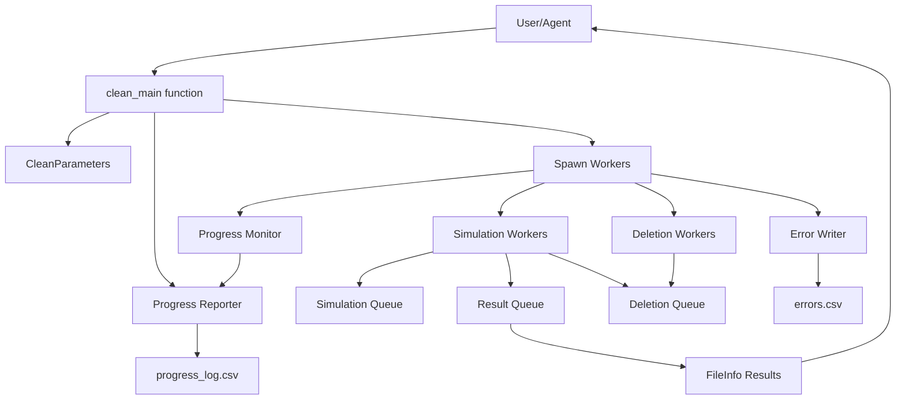
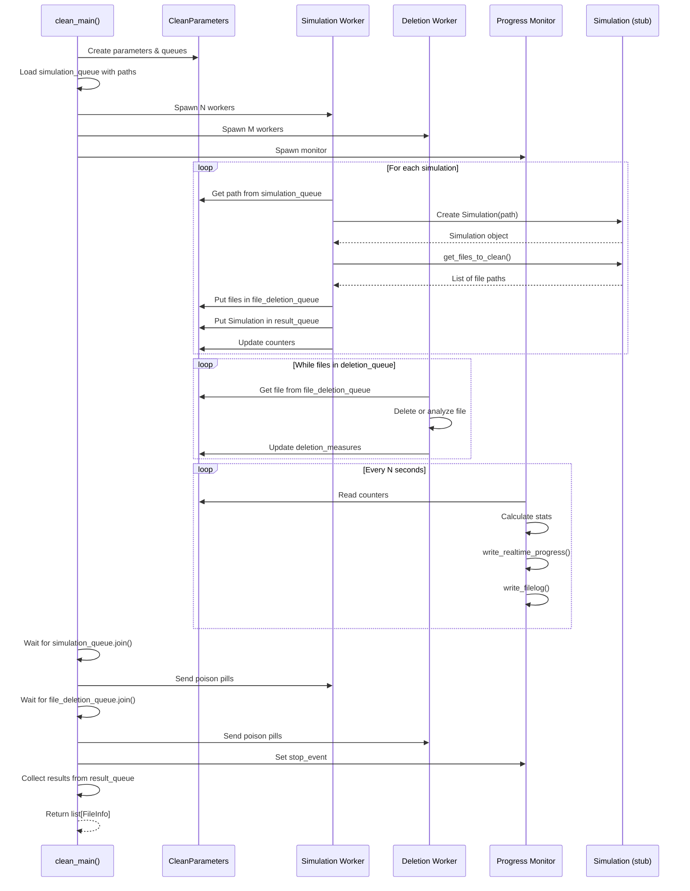
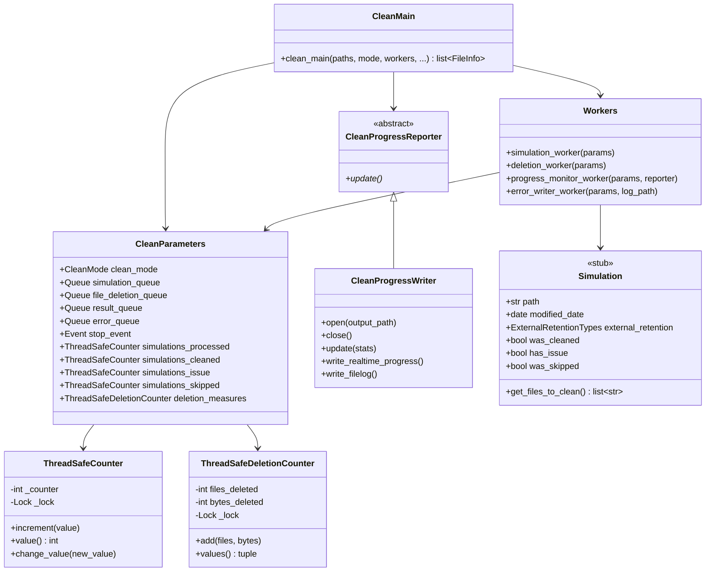
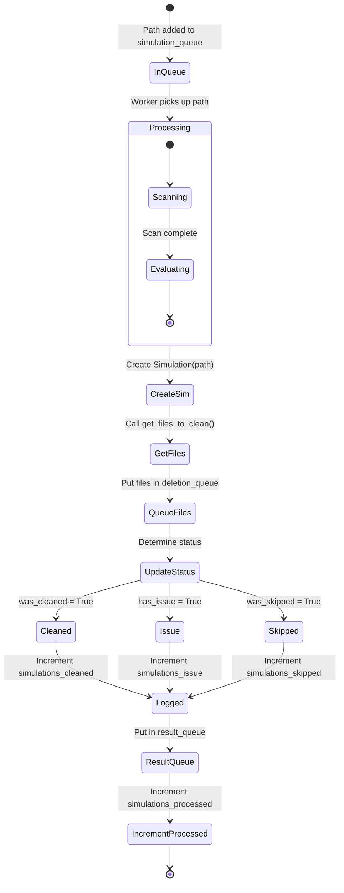
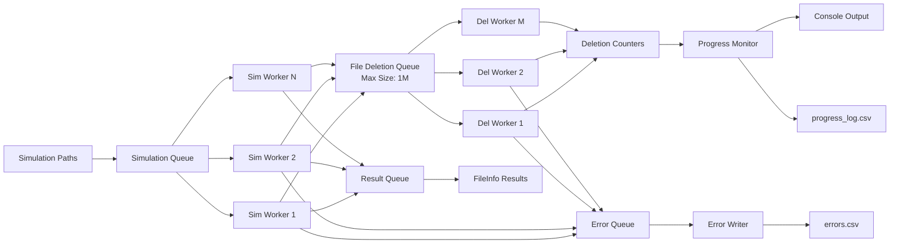
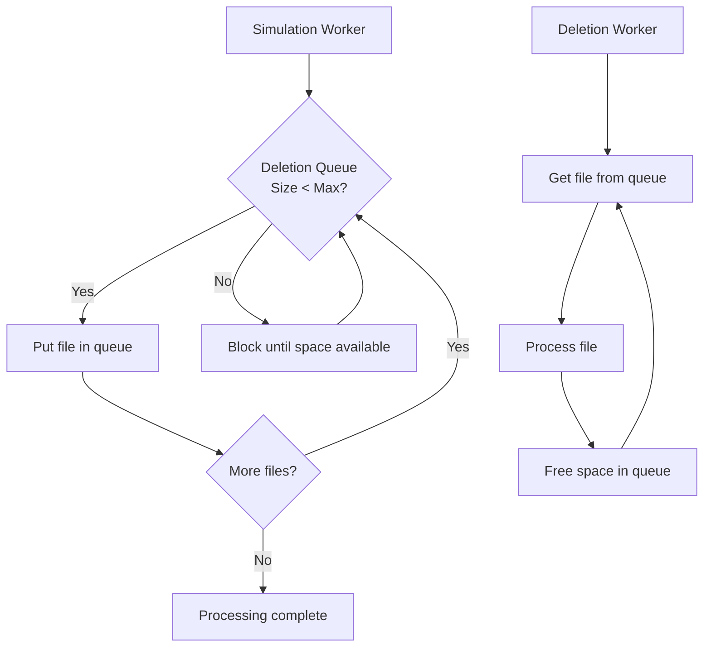
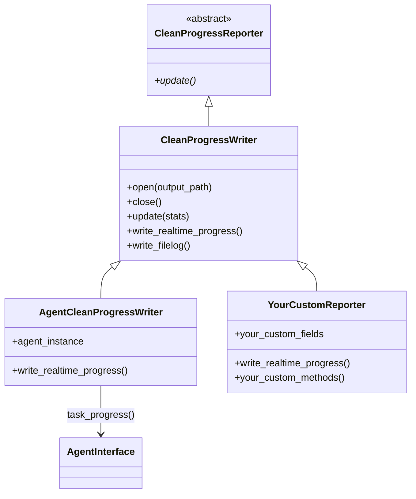
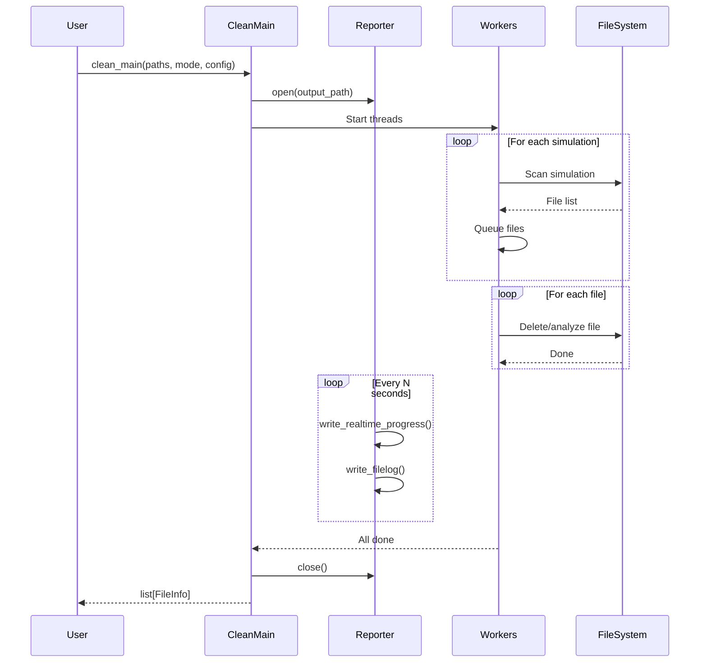

# Clean Agent Architecture Diagrams

## System Overview

## Thread Flow

## Component Architecture

## State Diagram - Simulation Processing

## Data Flow

## Backpressure Mechanism

## Custom Progress Reporter Extension

## Usage Pattern

